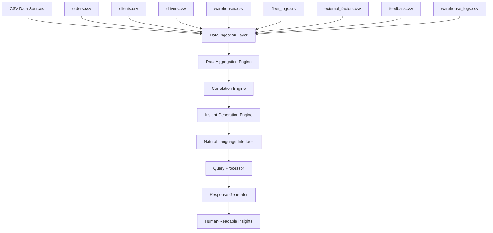

# Design Document

## Overview

The Logistics Insight System is designed as a lightweight, data-driven analytics engine that aggregates multi-domain logistics data to provide human-readable insights and actionable recommendations. The system follows a phased delivery approach with a focus on demonstrable prototype capabilities using the provided sample dataset.

The core architecture centers around a data aggregation engine that correlates events across orders, fleet operations, warehouse activities, external factors, and customer feedback to generate narrative explanations for complex delivery scenarios.

## Architecture

### High-Level Architecture



### System Components

1. **Data Ingestion Layer**: Loads and validates CSV data sources
2. **Data Aggregation Engine**: Combines related data across different domains
3. **Correlation Engine**: Identifies relationships between events and factors
4. **Insight Generation Engine**: Transforms correlations into business insights
5. **Natural Language Interface**: Processes queries and generates responses
6. **Query Processor**: Interprets specific use case questions
7. **Response Generator**: Creates narrative explanations with recommendations

## Components and Interfaces

### Data Models

#### Core Data Entities (Based on Sample Dataset)

**Order Entity (orders.csv)**
- order_id, client_id, customer_name, customer_phone, delivery_address_line1, delivery_address_line2, city, state, pincode, order_date, promised_delivery_date, actual_delivery_date, status, payment_mode, amount, failure_reason, created_at

**Client Entity (clients.csv)**
- client_id, client_name, gst_number, contact_person, contact_phone, contact_email, address_line1, address_line2, city, state, pincode, created_at

**Driver Entity (drivers.csv)**
- driver_id, driver_name, phone, license_number, partner_company, city, state, status, created_at

**Warehouse Entity (warehouses.csv)**
- warehouse_id, warehouse_name, state, city, pincode, capacity, manager_name, contact_phone, created_at

**Fleet Log Entity (fleet_logs.csv)**
- fleet_log_id, order_id, driver_id, vehicle_number, route_code, gps_delay_notes, departure_time, arrival_time, created_at

**External Factor Entity (external_factors.csv)**
- factor_id, order_id, traffic_condition, weather_condition, event_type, recorded_at

**Feedback Entity (feedback.csv)**
- feedback_id, order_id, customer_name, feedback_text, sentiment, rating, created_at

**Warehouse Log Entity (warehouse_logs.csv)**
- log_id, order_id, warehouse_id, picking_start, picking_end, dispatch_time, notes

### Interface Specifications

#### DataLoader Interface
```python
class DataLoader:
    def load_orders() -> pd.DataFrame:
        # Loads orders.csv with columns: order_id, client_id, customer_name, customer_phone, 
        # delivery_address_line1, delivery_address_line2, city, state, pincode, order_date, 
        # promised_delivery_date, actual_delivery_date, status, payment_mode, amount, failure_reason, created_at
        
    def load_clients() -> pd.DataFrame:
        # Loads clients.csv with columns: client_id, client_name, gst_number, contact_person, 
        # contact_phone, contact_email, address_line1, address_line2, city, state, pincode, created_at
        
    def load_drivers() -> pd.DataFrame:
        # Loads drivers.csv with columns: driver_id, driver_name, phone, license_number, 
        # partner_company, city, state, status, created_at
        
    def load_warehouses() -> pd.DataFrame:
        # Loads warehouses.csv with columns: warehouse_id, warehouse_name, state, city, 
        # pincode, capacity, manager_name, contact_phone, created_at
        
    def load_fleet_logs() -> pd.DataFrame:
        # Loads fleet_logs.csv with columns: fleet_log_id, order_id, driver_id, vehicle_number, 
        # route_code, gps_delay_notes, departure_time, arrival_time, created_at
        
    def load_external_factors() -> pd.DataFrame:
        # Loads external_factors.csv with columns: factor_id, order_id, traffic_condition, 
        # weather_condition, event_type, recorded_at
        
    def load_feedback() -> pd.DataFrame:
        # Loads feedback.csv with columns: feedback_id, order_id, customer_name, 
        # feedback_text, sentiment, rating, created_at
        
    def load_warehouse_logs() -> pd.DataFrame:
        # Loads warehouse_logs.csv with columns: log_id, order_id, warehouse_id, 
        # picking_start, picking_end, dispatch_time, notes
```

#### CorrelationEngine Interface
```python
class CorrelationEngine:
    def correlate_order_with_fleet(order_id) -> dict
    def correlate_order_with_warehouse(order_id) -> dict
    def correlate_order_with_external_factors(order_id) -> dict
    def correlate_order_with_feedback(order_id) -> dict
    def find_patterns_by_city(city, date_range) -> dict
    def find_patterns_by_client(client_id, date_range) -> dict
    def find_patterns_by_warehouse(warehouse_id, date_range) -> dict
```

#### InsightGenerator Interface
```python
class InsightGenerator:
    def generate_city_delay_analysis(city, date) -> str
    def generate_client_failure_analysis(client_id, date_range) -> str
    def generate_warehouse_failure_analysis(warehouse_id, date_range) -> str
    def generate_city_comparison(city_a, city_b, date_range) -> str
    def generate_festival_period_analysis() -> str
    def generate_capacity_impact_analysis(client_id, order_volume) -> str
```

#### QueryProcessor Interface
```python
class QueryProcessor:
    def process_query(query: str) -> dict
    def extract_entities(query: str) -> dict
    def determine_query_type(query: str) -> str
    def extract_date_range(query: str) -> tuple
    def parse_flexible_time_expressions(time_expr: str) -> tuple
    def validate_date_availability(start_date: datetime, end_date: datetime) -> bool
```

## Data Models

### Aggregated Data Structure

The system will create aggregated views combining multiple data sources:

**Comprehensive Order View**
```python
{
    'order_info': {
        'order_id': int,
        'customer_name': str,
        'customer_phone': str,
        'order_date': datetime,
        'promised_delivery_date': datetime,
        'actual_delivery_date': datetime,
        'status': str,
        'payment_mode': str,
        'amount': float,
        'failure_reason': str
    },
    'client_info': {
        'client_id': int,
        'client_name': str,
        'gst_number': str,
        'contact_person': str,
        'contact_phone': str,
        'contact_email': str
    },
    'delivery_location': {
        'delivery_address_line1': str,
        'delivery_address_line2': str,
        'city': str,
        'state': str,
        'pincode': str
    },
    'fleet_activity': {
        'driver_id': int,
        'driver_name': str,
        'vehicle_number': str,
        'route_code': str,
        'gps_delay_notes': str,
        'departure_time': datetime,
        'arrival_time': datetime,
        'partner_company': str
    },
    'warehouse_activity': {
        'warehouse_id': int,
        'warehouse_name': str,
        'picking_start': datetime,
        'picking_end': datetime,
        'dispatch_time': datetime,
        'notes': str
    },
    'external_conditions': {
        'traffic_condition': str,
        'weather_condition': str,
        'event_type': str
    },
    'customer_feedback': {
        'feedback_text': str,
        'sentiment': str,
        'rating': int
    }
}
```

**City Performance Metrics**
```python
{
    'city_name': str,
    'total_orders': int,
    'success_rate': float,
    'common_failure_reasons': list,
    'average_delay_time': float,
    'weather_impact': dict,
    'traffic_impact': dict,
    'warehouse_performance': dict
}
```

**Client Performance Profile**
```python
{
    'client_id': int,
    'client_name': str,
    'order_volume': int,
    'success_rate': float,
    'failure_patterns': dict,
    'delivery_locations': list,
    'payment_preferences': dict,
    'feedback_trends': dict
}
```

## Error Handling

### Data Validation
- **Missing Data**: Handle missing CSV files gracefully with informative error messages
- **Data Quality**: Validate data types and required fields, report inconsistencies
- **Date Parsing**: Handle various date formats and invalid dates
- **Reference Integrity**: Validate foreign key relationships between datasets

### Query Processing
- **Invalid Queries**: Provide helpful error messages for unsupported query types
- **Date Range Validation**: Ensure date ranges are valid and within available data
- **Entity Validation**: Verify that referenced cities, clients, warehouses exist in data
- **Flexible Time Parsing**: Handle various time expressions including relative dates, specific months/years, quarters, and date ranges
- **Data Availability**: Inform users when requested time periods exceed available data and provide alternative suggestions

### System Resilience
- **Partial Data**: Continue processing even if some data sources are incomplete
- **Memory Management**: Handle large datasets efficiently with pandas optimization
- **Performance**: Implement caching for frequently accessed correlations

## Testing Strategy

### Unit Testing
- **Data Loading**: Test CSV parsing and data validation
- **Correlation Logic**: Test relationship identification between entities
- **Insight Generation**: Test narrative generation for various scenarios
- **Query Processing**: Test natural language query interpretation

### Integration Testing
- **End-to-End Workflows**: Test complete query processing from input to insight
- **Data Consistency**: Verify correlations across multiple data sources
- **Sample Use Cases**: Test all six specified use cases with sample data

### Demo Testing
- **Sample Queries**: Validate responses for all provided use cases
- **Performance**: Ensure reasonable response times for demo scenarios
- **Output Quality**: Verify insights are human-readable and actionable

### Data Testing
- **Sample Dataset**: Validate system works with provided CSV files
- **Edge Cases**: Test with missing data, invalid dates, empty results
- **Scalability**: Test with larger datasets to understand limitations

## Implementation Phases

### Phase 1: Documentation & Architecture
- Professional Word document with business challenge explanation
- Architecture diagram showing data flow and system components
- Use case documentation with expected outcomes

### Phase 2: Prototype Development
- Python script with pandas for data manipulation
- Core correlation engine implementation
- Basic insight generation for sample queries
- Command-line interface for query processing

### Phase 3: Demo & Validation
- Screen recording with voice walkthrough
- Demonstration of all six use cases
- Explanation of correlation logic and insights
- Performance and scalability discussion

### Phase 4: Packaging & Delivery
- GitHub repository with complete codebase
- README with setup and usage instructions
- Organized delivery folder with documentation and demo video
- Professional email template for client delivery