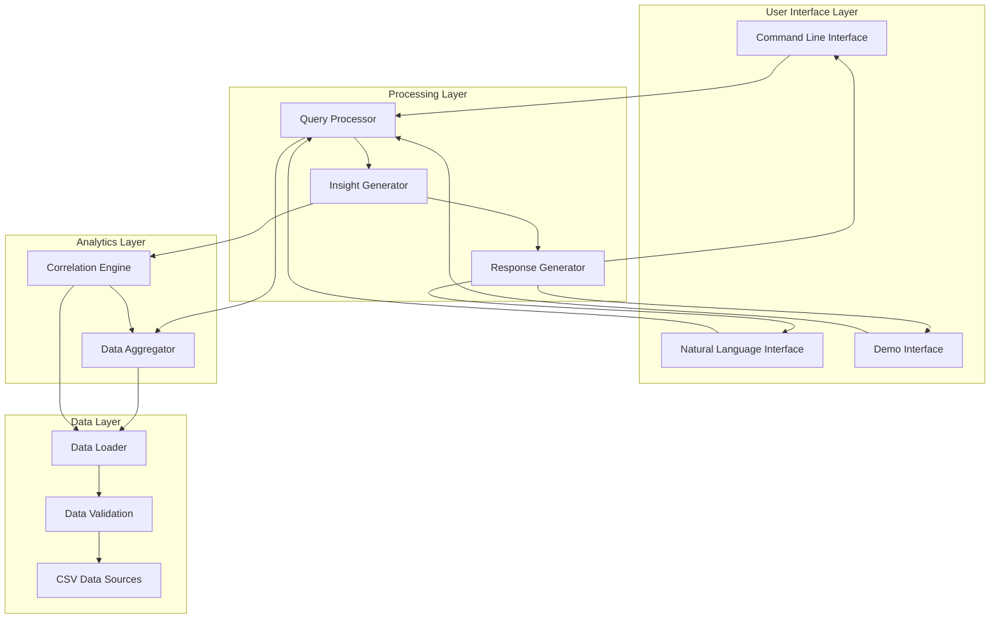
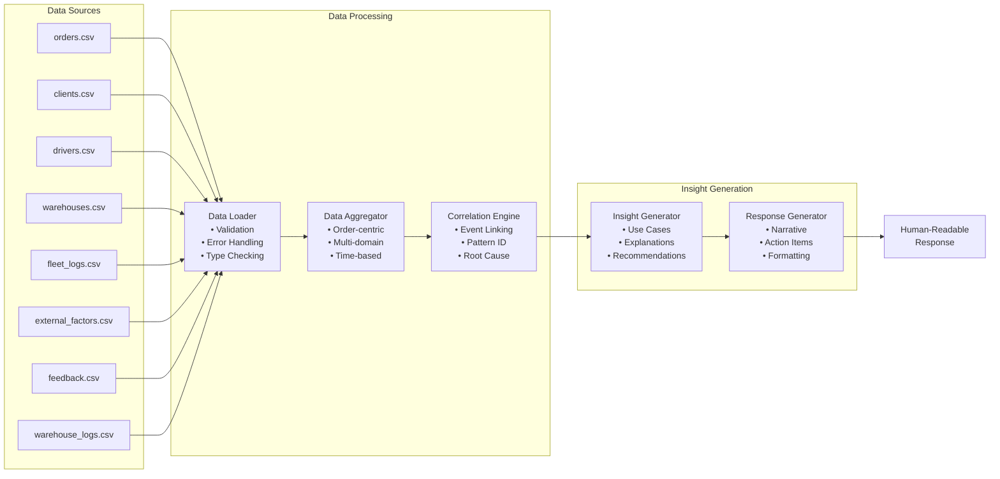
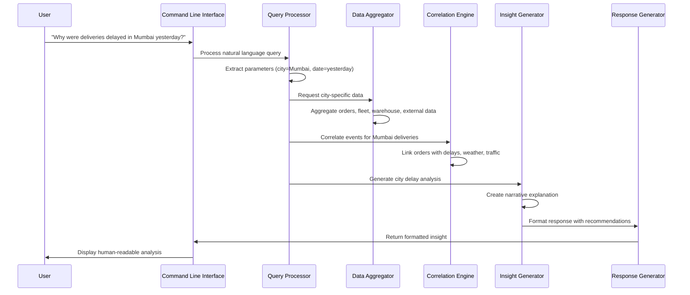
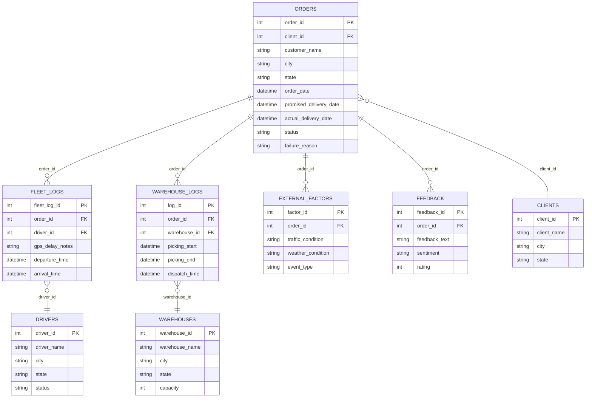
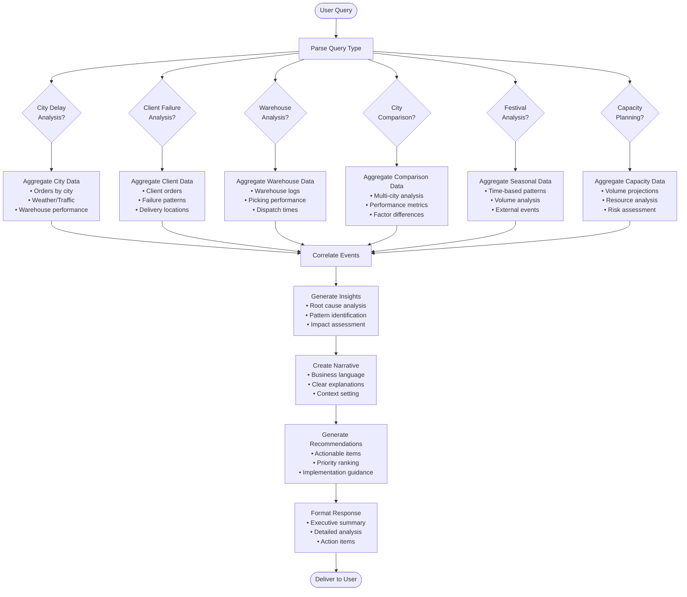
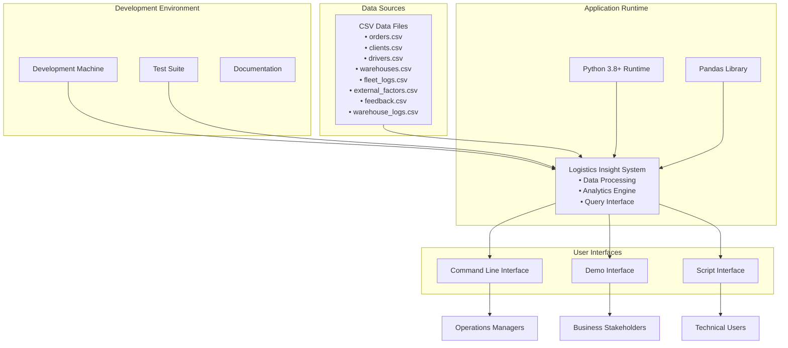

# Logistics Insight System - Architecture Diagrams

## High-Level System Architecture

## Data Flow Architecture

## Component Interaction Diagram

## Data Model Relationships

## Use Case Processing Flow

## System Deployment Architecture

---

*These diagrams illustrate the comprehensive architecture of the Logistics Insight System, showing data flow, component interactions, and system deployment structure.*